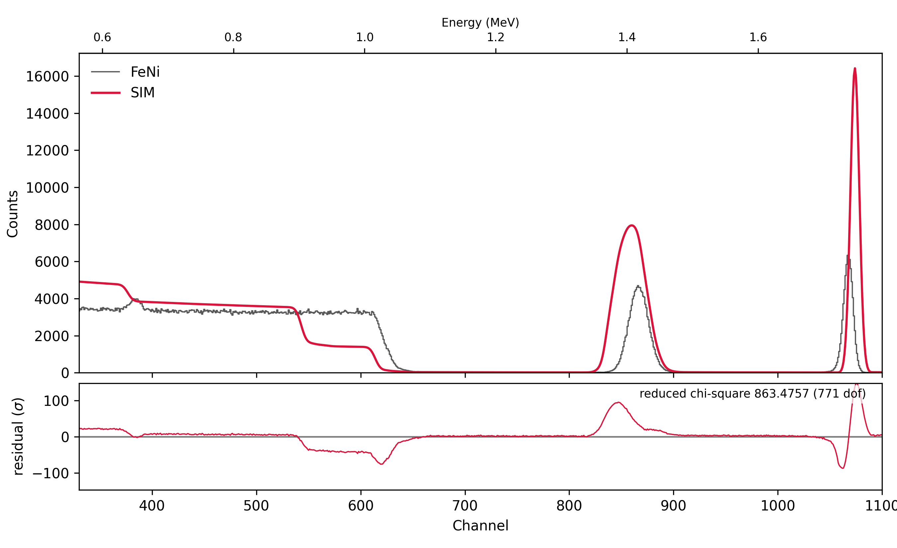
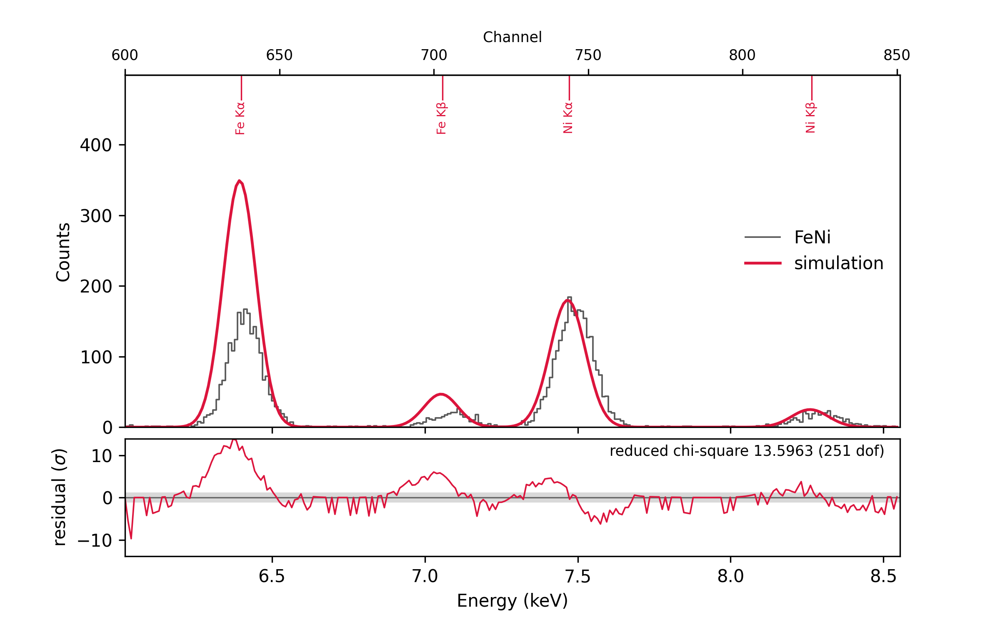

# Worked example: an FeNi film with RBS and PIXE

This walk-through fits a real measurement from start to finish. RBS gives
the layer thicknesses, and PIXE tells Fe from Ni, which RBS can hardly
separate. It uses the two files in `examples/`:

* `FeNi.RBS`, the RBS spectrum: an RC43 acquisition macro, 1.9 MeV ⁴He⁺,
  40 µC, detector at 170°, sample tilted to `THETA -9`;
* `FeNi.PIX`, the PIXE spectrum measured in the same run, with the same
  charge.

The sample is Si / SiO₂ / FeNi / Pt: a thin Pt cap on an FeNi film, on
thermal oxide on a Si wafer. The question is the FeNi composition.

Every command below is typed at the prompt it is shown with. The outputs
are pyRUMP's own, from this data.

## 1. Load both spectra

`PAIR ON` makes reading `x.RBS` also read `x.PIX` from the same folder
into the same buffer, so the two spectra share the beam, the tilt and the
charge:

```
Your wish? cd examples
Your wish? pixe pair on
  pair on
  ! THETA 0 from the RBS buffer (PAIR ON): beam 0 deg, X-rays 45 deg to the sample normal
Your wish? xeq FeNi.RBS
buffer 1 emptied
  c:\RBS\data\FeNi.RBS
  FeNi.RBS  170 Degree RBS LT =  1072.816 RT  1075.544 Gain  2
  15:17:21  07-05-2022
  1.59 keV/channel, offset 40 keV
  MeV = 1.9
  beam Z=2 mass=4.0026 charge state 1
  geometry = general
  theta = -9 deg
  phi = 11 deg
  psi = 20 deg
  omega = 2.7 msr
  first = 0
  FWHM = 15 keV
  current = 38.2 nA
  charge = 40 uC
2048 points entered into buffer 1
  PAIR: FeNi.PIX -> PIXE of this buffer
```

`FeNi.RBS` is a text macro, so it is read with `XEQ`, not `GET` (see
[Data loading](index.md#data-loading)). Put `pixe pair on` in your
`~/.pyrumprc` if you always measure both.

## 2. Read the RBS spectrum

Plot the RBS spectrum and ask where each element's surface edge would be:

```
Your wish? plot 1
Your wish? region 330 1100
Your wish? element Pt Ni Fe Si O
  Pt  Z=78  Mass=195.090  K(ion)=0.9219  Energy=  1751.6 keV  Channel=1076.478
  Ni  Z=28  Mass= 58.710  K(ion)=0.7629  Energy=  1449.5 keV  Channel= 886.490
  Fe  Z=26  Mass= 55.847  K(ion)=0.7524  Energy=  1429.5 keV  Channel= 873.888
  Si  Z=14  Mass= 28.086  K(ion)=0.5663  Energy=  1075.9 keV  Channel= 651.495
  O   Z= 8  Mass= 15.999  K(ion)=0.3631  Energy=   689.8 keV  Channel= 408.677
```

The spectrum shows, from high to low energy:

* a narrow **Pt** peak near channel 1065: a thin layer at the surface;
* an **FeNi** peak near channel 865, a little below the Fe and Ni surface
  edges. The film lies under the Pt, and the beam loses energy in the Pt
  on the way in and out;
* the **Si** step near channel 615 and the **O** peak near 385, both well
  below their surface edges: the oxide and the wafer lie under the metal.

The channels from `ELEMENT` use the header's calibration (1.59 keV/ch,
40 keV), which the fit will refine, so they are a guide, not a
measurement. Note also that the Fe and Ni edges are only 12.6 channels
apart. With a 17 keV (≈ 10 channel) detector resolution and a film ~40
channels wide, the two elements overlap completely in RBS. That's why we
need PIXE.

## 3. Describe the sample in SIM, layer by layer

Layer 1 is the surface, the layer the beam meets first. Each layer gets
a thickness and a composition; the composition line ends with `/`. The
starting thicknesses only need to be rough: `/cm2` is RUMP's areal
density unit, 10¹⁵ atoms/cm² (about 0.15 nm of Pt or 0.2 nm of Si).

```
Your wish? sim
SIM Command: layer 1
  you are now working on a fresh layer # 1 (of 0)
SIM Command: thickness 30 /cm2
SIM Command: composition Pt 1 /
SIM Command: next
  you are now working on a fresh layer # 2 (of 1)
SIM Command: thickness 400 /cm2
SIM Command: composition Fe 1 Ni 1 /
SIM Command: next
  you are now working on a fresh layer # 3 (of 2)
SIM Command: thickness 1500 /cm2
SIM Command: composition Si 1 O 2 /
SIM Command: next
  you are now working on a fresh layer # 4 (of 3)
SIM Command: thickness 20000 /cm2
SIM Command: composition Si 1 /
SIM Command: show
    1            30 /cm2     Pt 1        [30 /CM2  Pt 30]
    2           400 /cm2     Fe 1 Ni 1   [400 /CM2  Fe 200 Ni 200]
    3          1500 /cm2     Si 1 O 2    [1500 /CM2  Si 500 O 1000]
 >  4         20000 /cm2     Si 1        [20000 /CM2  Si 20000]
  maxpth 1000   straggle 0   multiple 0   absorber 0
SIM Command: return
```

* **Layer 1, Pt**: the thin cap.
* **Layer 2, FeNi**: `Fe 1 Ni 1` is a starting ratio. In COMP mode the
  numbers are relative amounts, so `Fe 1 Ni 1` and `Fe 50 Ni 50` are the
  same layer.
* **Layer 3, SiO₂**: `Si 1 O 2`.
* **Layer 4, the Si wafer**: the last layer is the substrate. It only has
  to be thicker than the beam can see; 20000 /cm2 (≈ 4 µm) is plenty
  for 1.9 MeV He, and a larger value changes nothing.

You can give thicknesses in Å or nm as well (`thickness 25 A`); `SIM
DENSITY` lists the units. `SIM SAVE feni` writes the description to
`feni.lcm`, and `SIM GET feni` reads it back.

Compare the starting sample with the data:

```
Your wish? compare
```



Everything is in roughly the right place, and nothing fits yet. That is
what PERT is for.

## 4. Fit the RBS spectrum: thicknesses, calibration, dose

```
Your wish? pert
PERT Command: window 360 1090
  error windows [1] 360-1090
PERT Command: normalize 420 580
  normalisation window 420-580
PERT Command: thickness 1
  varying layer 1 thickness
PERT Command: thickness 2
  varying layer 2 thickness
PERT Command: thickness 3
  varying layer 3 thickness
PERT Command: slope
  varying kev/ch
PERT Command: offset
  varying kev(0)
PERT Command: fwhm
  varying fwhm
PERT Command: go
  Fitting FeNi: Si [20000/cm2] - SiO2 [1500/cm2] - FeNi [400/cm2] - Pt [30/cm2]

  fit took 0.82 s

  reduced chi-square 20.4852 on 725 dof   (was 887.0835)
  136 evaluations, converged
  data scaled by 1.10996 over the norm window   (correction factor set to 1.11)
  layer 1 thickness                 15 /cm2  +/- 0.1072 /cm2   (was 30 /cm2)
  layer 2 thickness                182 /cm2  +/- 0.3915 /cm2   (was 400 /cm2)
  layer 3 thickness                401 /cm2  +/- 2.17 /cm2   (was 1500 /cm2)
  kev/ch                            1.62771  +/- 7.202e-05   (was 1.59)
  kev(0)                            13.0775  +/- 0.06801   (was 40)
  fwhm                              16.8723  +/- 0.06609   (was 15)

  FeNi: Si [20000/cm2] - SiO2 [401/cm2] - FeNi [182/cm2] - Pt [15/cm2]
PERT Command: go
  ...
  reduced chi-square 18.1536 on 725 dof   (was 18.1536)
  ...
PERT Command: return
```

What each setting does:

* **`WINDOW 360 1090`**: fit from just below the O peak to just above the
  Pt edge. The pile-up and multiple scattering below channel 360 are not
  simulated, so they stay out.
* **`NORMALIZE 420 580`**: the flat Si plateau, whose height depends only
  on the dose and on silicon's stopping. PERT scales the data so their
  total there matches the simulation, and writes the scale into the
  buffer's `CORRECTION`. Here the charge reading is 11 % off
  (`CORRECTION 1.11`). The PIXE spectrum takes the same correction, since
  it shares the charge.
* **`THICKNESS 1 2 3`**: the three films. The substrate stays fixed.
* **`SLOPE`, `OFFSET`, `FWHM`**: the energy calibration and the
  resolution. The values in the file header are only a starting point.

`GO` writes the fitted values back into the SIM sample, so a second `GO`
starts where the first one ended. Run `GO` until the values stop
changing.

RBS alone can't be trusted with the last step, the Fe-to-Ni ratio. It
shows up only in the shape of the FeNi peak, the two elements' edges
being one resolution apart, and a small calibration error or a little
roughness changes that shape as much.

## 5. Set up the PIXE spectrum

`PIXE` opens the PIXE prompt. Zoom on the Fe and Ni K lines and compare:

```
Your wish? pixe
PIXE enabled: PLOT and COMPARE now show PIXE too (DISABLE turns it off)
PIXE Command: region 600 850
  region 600 to 850
PIXE Command: linear
  PIXE yield axis is linear
PIXE Command: compare
```



The four lines are Fe Kα and Kβ, and Ni Kα and Kβ, on almost no
background. Their heights don't match yet, because the composition is
still `Fe 1 Ni 1`. The simulated peaks also sit 2–3 channels low and are
too narrow. Fix the calibration and the resolution before fitting:

* **Calibration.** Read the two Kα peak centres off the channel axis
  along the top of the plot: Fe Kα,
  6.3995 keV, at channel 638.9; Ni Kα, 7.4723 keV, at channel 745.7.
  Channel *N* is centred at (*N* + 0.5) × gain + offset, so
  gain = (7.4723 − 6.3995) / (745.7 − 638.9) = 0.010045 keV/ch and
  offset = 6.3995 − 639.4 × 0.010045 = −0.0233 keV.
* **Resolution.** The measured peaks are about 7 % wider than the default
  122 eV (quoted at Mn Kα) gives. 131 eV makes them match.

```
PIXE Command: calib 0.010045 -0.0233
  calib 0.010045 -0.0233  ! keV/ch, keV
PIXE Command: fwhm 131
  fwhm 131  ! eV at Mn Ka
PIXE Command: return
```

`SHOW` at the PIXE prompt lists every PIXE setting. With `PAIR ON` the
PIXE detector takes the sample tilt from the RBS buffer: `THETA -9` puts
the beam 9° and the X-rays 36° from the sample normal.

## 6. Fit the composition from PIXE

Now tell PERT which spectrum fits what. `PIXE` after the element in
`COMPOSITION` fits that element to the PIXE spectrum; everything without
it, here the three thicknesses, is fitted to RBS as before:

* **`PIXWIN 500 850`**: the PIXE channels with the four lines.
* **`COMPOSITION 2 Ni PIXE`**: Ni's content against Fe, which stays at 1
  as the reference, from the X-ray lines.
* **`PIXH`**: vary the PIXE instrumental constant H with it. H takes up
  whatever the PIXE detector's solid angle, filter and cross sections get
  wrong, so PIXE only has to give the Ni-to-Fe ratio. GO varies H of the
  shells whose lines of the PIXE elements fall in the windows: here the K
  shell. Without `PIXH`, H stays at the PIXE prompt's values, as
  calibrated.

```
Your wish? pert
PERT Command: clear
  PERT settings cleared
PERT Command: window 360 1090
  error windows [1] 360-1090
PERT Command: normalize 420 580
  normalisation window 420-580
PERT Command: pixwin 500 850
  PIXE windows [1] 500-850
PERT Command: composition 2 Ni pixe
  varying layer 2 composition Ni
PERT Command: thickness 1
  varying layer 1 thickness
PERT Command: thickness 2
  varying layer 2 thickness
PERT Command: thickness 3
  varying layer 3 thickness
PERT Command: pixh
  varying PIXH
PERT Command: parms
  mode        multiple variable
  autocmp     off
  report      off
  highlight   on
  error win   [1] 360-1090
  norm win    420-580
  PIXE win    [1] 500-850
  PIXE H      K 1   L 1   M 1   K fitted (Ni K lines in the PIXE windows)
  varying:
    [1] layer 2 composition Ni       PIXE
    [2] layer 1 thickness            RBS
    [3] layer 2 thickness            RBS
    [4] layer 3 thickness            RBS
    [5] PIXH                         PIXE
```

`PARMS` lists which spectrum fits each parameter, and which H is fitted
and why. `GO` then fits Ni and H_K to the PIXE spectrum over channels
500–850, the thicknesses to the RBS spectrum over 360–1090, and repeats
the two until nothing moves: the PIXE yields depend a little on the
thicknesses, the RBS spectrum on the composition.

```
PERT Command: go
  Fitting FeNi: Si [20000/cm2] - SiO2 [401/cm2] - FeNi [182/cm2] - Pt [15/cm2]
  PIXE, channels 500-850: layer 2 composition Ni, PIXH K
  RBS, channels 360-1090: layer 1 thickness, layer 2 thickness, layer 3 thickness

  fit took 0.63 s, 3 rounds PIXE -> RBS

  PIXE: reduced chi-square 3.4791 on 349 dof   (was 8.7103)
  RBS:  reduced chi-square 22.3077 on 728 dof   (was 25.7546)
  75 evaluations, converged
  data scaled by 1.00033 over the norm window   (correction factor set to 1.1118)
  layer 2 composition Ni             2.1026  +/- 0.05747   (was 1)
  layer 1 thickness                 14 /cm2  +/- 0.05092 /cm2   (was 15 /cm2)
  layer 2 thickness                202 /cm2  +/- 0.3793 /cm2   (was 182 /cm2)
  layer 3 thickness                336 /cm2  +/- 2.351 /cm2   (was 401 /cm2)
  PIXH K                           0.665863  +/- 0.00941   (was 1)

  FeNi: Si [20000/cm2] - SiO2 [336/cm2] - FeNi2.10 [202/cm2] - Pt [14/cm2]
```

Each spectrum reports its own chi-square. The PIXE one is the measure of
the composition fit; the RBS one of the thicknesses. A second `GO` takes
one round and changes nothing, which confirms the fit has settled.

Fitting Ni to PIXE rather than RBS matters here. Each parameter is fitted
to one spectrum only, so the RBS spectrum, with about 200 times the
counts (1.07 million against 5500 over the windows) and its remaining
misfit, can't pull the composition its way.


All four lines now match. Only the Ni content and H_K were free; each
Kβ follows from its Kα through the atomic data, so the two Kβ peaks
matching too is a check on the calibration and the line data.

## 7. The result, and what it leaves open

```
Your wish? sim show
 >  1            14 /cm2     Pt 1           [14 /CM2  Pt 14.05]
    2           202 /cm2     Fe 1 Ni 2.10   [202 /CM2  Fe 65.11 Ni 136.89]
    3           336 /cm2     Si 1 O 2       [336 /CM2  Si 112.01 O 224.02]
    4         20000 /cm2     Si 1           [20000 /CM2  Si 20000]
  maxpth 1000   straggle 0   multiple 0   absorber 0
```

| Layer | Areal density (10¹⁵ at/cm²) | Composition |
|---|---|---|
| Pt | 14 | |
| FeNi | 202 (Fe 65, Ni 137) | Ni/Fe = 2.10 ± 0.06, i.e. Fe₃₂Ni₆₈ |
| SiO₂ | 336 | |

The uncertainties are statistical only, as PERT reports them.


The RBS fit shows what remains. With the PIXE composition, the simulated
FeNi peak is taller and narrower than the measured one: the film looks
rougher, or more intermixed with its neighbours, than flat layers allow.
The O peak and the Si step are slightly off in position as well. These
residuals are the next things to work on, and they are why the RBS
χ²/dof stays near 22.

H_K = 0.67 means the PIXE setup constants predict 1.5 times the measured
K-line yield at this dose. H absorbs that, so the ratio doesn't depend on
it. For absolute amounts from PIXE, calibrate H on a standard measured
the same way (`PIXE H K <value>`).

## 8. Keep the result: REPORT and SNAPSHOT

**`REPORT ON`** in PERT saves the result after every `GO` by itself:

```
PERT Command: report on
  report on
PERT Command: go
  ...
  FeNi: Si [20000/cm2] - SiO2 [336/cm2] - FeNi2.10 [202/cm2] - Pt [14/cm2]

  updated FeNi.report
  wrote FeNi.pert
  wrote FeNi.lcm
  wrote FeNi_rbs.png
  wrote FeNi_pixe.png
  wrote FeNi_fit.xeq
```

The files are named after the sample, the first word of the spectrum's
identifier (`FeNi`), in the current folder:

| File | Contents |
|---|---|
| `FeNi.report` | The fit output, the sample and the data's parameters. A new block is **appended** after every `GO`, so it keeps the history of your fits |
| `FeNi.pert` | The PERT setup, as `PERT SAVE` writes it |
| `FeNi.lcm` | The sample, as `SIM SAVE` writes it |
| `FeNi_rbs.png`, `FeNi_pixe.png` | The RBS and PIXE `COMPARE` plots |
| `FeNi_fit.xeq` | A restore macro for the whole session |

`FeNi.pert` holds everything step 6 typed, and `PERT GET FeNi GO` replays
it and fits in one line:

```
window 360 1090
pixwin 500 850
normalize 420 580
composition 2 Ni pixe
thickness 1
thickness 2
thickness 3
pixh
```

**`SNAP`** (`SNAPSHOT`) at the RUMP prompt writes the same files at any
time, for instance after you've adjusted a thickness by hand to look at
the residuals. Without `REPORT`, it is the one command to remember before
you stop:

```
Your wish? snap

  updated FeNi.report
  wrote FeNi.pert
  wrote FeNi.lcm
  wrote FeNi_rbs.png
  wrote FeNi_pixe.png
  wrote FeNi_fit.xeq
```

**To pick up later**, run the restore macro, from any folder:

```bash
pyrump FeNi_fit.xeq
```

or `XEQ FeNi_fit` inside a running session. It reads `FeNi.RBS` and
`FeNi.PIX` again, and sets back everything the analysis changed: the PIXE
detector settings and calibration, the fitted H_K, the RBS calibration,
resolution and `CORRECTION`, the sample, the PERT setup and both plots.
The data files have to stay where they were; the macro records their
paths.

See [PERT](../manual/pert.md), [PIXE](../manual/pixe.md) and
[`SNAPSHOT`](../manual/shell.md#snapshot-snap-new) in the manual for every
option used here.
