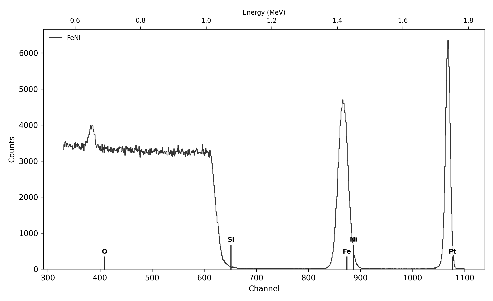
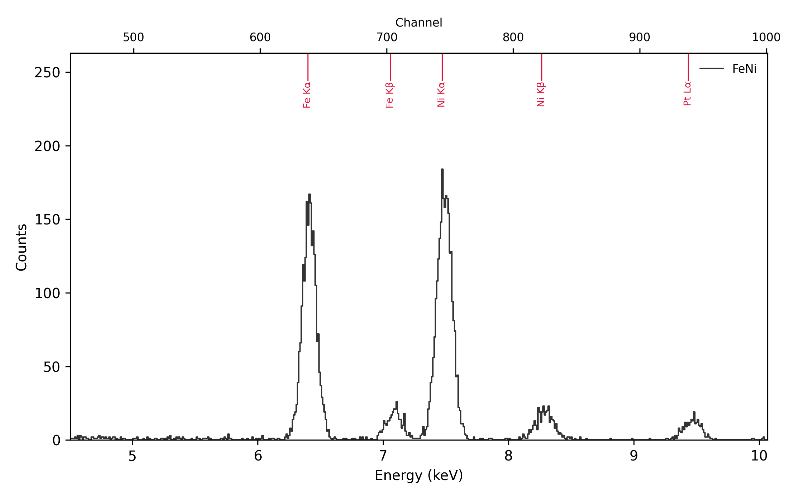
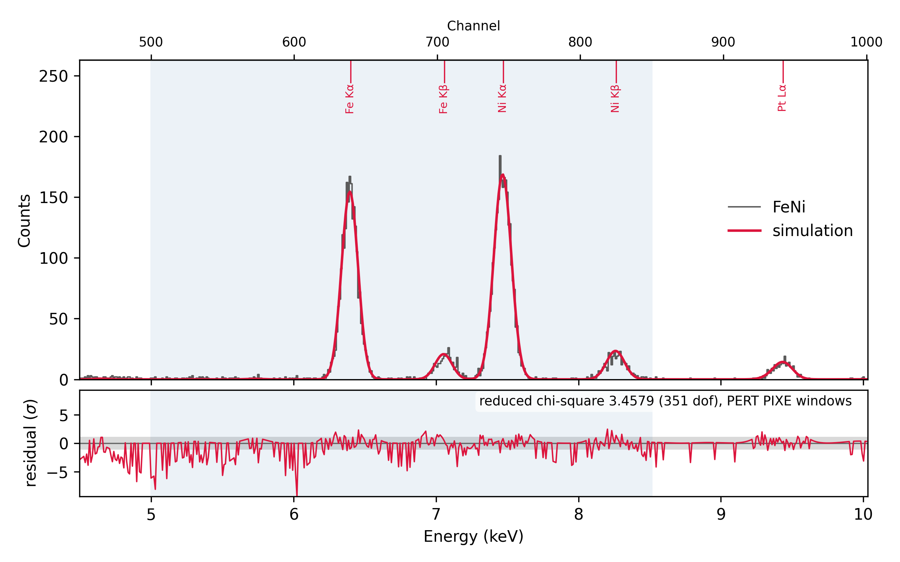
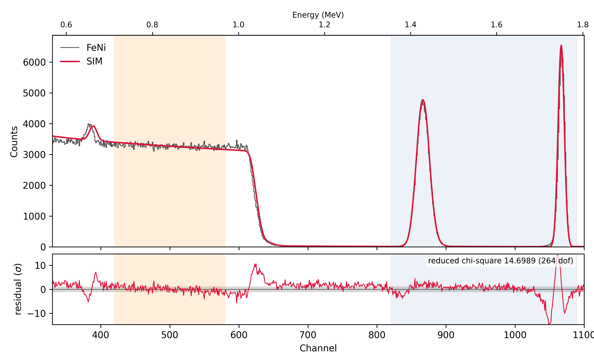

# Worked example: an FeNi film with RBS and PIXE

This walk-through fits a real measurement from start to finish. RBS gives
the layer thicknesses, and PIXE tells Fe from Ni, which RBS can hardly
separate. It uses the two files in `examples/`:

* `FeNi.RBS`, the RBS spectrum: an RC43 acquisition macro, 1.9 MeV ⁴He⁺,
  40 µC, detector at 170°, sample tilted to `THETA -9`;
* `FeNi.PIX`, the PIXE spectrum measured in the same run, with the same
  charge.

The sample is Si / SiO₂ / FeNi / Pt: a thin Pt cap on an FeNi film, on
the thermal oxide of a Si wafer. The question is the FeNi composition.

Every command below is typed at the prompt it is shown with. The outputs
are pyRUMP's own, from this data.

## 1. Load both spectra

`PAIR ON` makes reading `x.RBS` also read `x.PIX` from the same folder
into the same buffer, so the two spectra share the beam, the tilt and the
charge:

```
Your wish? cd examples
Your wish? pixe pair on
  pair on
  ! THETA 0 from the RBS buffer (PAIR ON): beam 0 deg, X-rays 45 deg to the sample normal
Your wish? xeq FeNi.RBS
buffer 1 emptied
  c:\RBS\data\FeNi.RBS
  FeNi.RBS  170 Degree RBS LT =  1072.816 RT  1075.544 Gain  2
  15:17:21  07-05-2022
  1.59 keV/channel, offset 40 keV
  MeV = 1.9
  beam Z=2 mass=4.0026 charge state 1
  geometry = general
  theta = -9 deg
  phi = 11 deg
  psi = 20 deg
  omega = 2.7 msr
  first = 0
  FWHM = 15 keV
  current = 38.2 nA
  charge = 40 uC
2048 points entered into buffer 1
  PAIR: FeNi.PIX -> PIXE of this buffer
```

`FeNi.RBS` is a text macro, so it is read with `XEQ`, not `GET` (see
[Data loading](index.md#data-loading)). Put `pixe pair on` in your
`~/.pyrumprc` if you always measure both.

## 2. Read the RBS and PIXE spectra

`PIXE` turns PIXE on, so `PLOT` shows the PIXE spectrum in its own window
next to the RBS one. Zoom both on what matters, and ask `ELEMENT` where
each element should show up:

```
Your wish? pixe
PIXE enabled: PLOT and COMPARE now show PIXE too (DISABLE turns it off)
PIXE Command: region 450 1000
  region 450 to 1000
PIXE Command: linear
  PIXE yield axis is linear
PIXE Command: return
Your wish? plot 1
Your wish? region 330 1100
Your wish? element Pt Ni Fe Si O
  Pt  Z=78  Mass=195.090  K(ion)=0.9219  Energy=  1751.6 keV  Channel=1076.478
      X-rays  Lα 9.435 keV ch 938.2   Lβ1 11.071 keV ch 1100.3   Lβ2 11.248 keV ch 1117.9
              Lγ1 12.942 keV ch 1285.6   Mα 2.050 keV ch 206.8   Mβ 2.127 keV ch 214.5
  Ni  Z=28  Mass= 58.710  K(ion)=0.7629  Energy=  1449.5 keV  Channel= 886.490
      X-rays  Kα 7.472 keV ch 743.9   Kβ 8.265 keV ch 822.4   Lα 0.851 keV ch 88.1
              Lβ1 0.868 keV ch 89.8
  Fe  Z=26  Mass= 55.847  K(ion)=0.7524  Energy=  1429.5 keV  Channel= 873.888
      X-rays  Kα 6.400 keV ch 637.6   Kβ 7.058 keV ch 702.8   Lα 0.705 keV ch 73.6
              Lβ1 0.718 keV ch 74.9
  Si  Z=14  Mass= 28.086  K(ion)=0.5663  Energy=  1075.9 keV  Channel= 651.495
      X-rays  Kα 1.740 keV ch 176.1   Kβ 1.836 keV ch 185.7
  O   Z= 8  Mass= 15.999  K(ion)=0.3631  Energy=   689.8 keV  Channel= 408.677
      X-rays  Kα 0.525 keV ch 55.8
```

For each element `ELEMENT` gives the RBS surface edge and, with PIXE on,
the main X-ray lines, and marks both on the plots.



The **RBS spectrum**, from high to low energy:

* a narrow **Pt** peak near channel 1065: a thin layer at the surface;
* an **FeNi** peak near channel 865, a little below the Fe and Ni surface
  edges. The film lies under the Pt, and the beam loses energy in the Pt
  on the way in and out;
* the **Si** step near channel 615 and the **O** peak near 385, both well
  below their surface edges: the oxide and the wafer lie under the metal.

The Fe and Ni edges are only 12.6 channels apart. With a ~17 keV
(≈ 10 channel) detector resolution and a film some 40 channels wide, the
two elements overlap completely in RBS. That's why the composition will
come from PIXE.



The **PIXE spectrum** shows the Fe and Ni Kα and Kβ lines and Pt Lα, on
almost no background. The markers sit 2–3 channels left of the peaks:
the calibration in the `.PIX` header is a little off. Set the PIXE
detector up before simulating anything:

* **Calibration.** `ELEMENT` puts the Kα lines at channels 637.6 (Fe) and
  743.9 (Ni) of the plot's channel axis. The peaks are centred at 639.4
  (Fe Kα, 6.3995 keV) and 746.2 (Ni Kα, 7.4723 keV) instead. The axis
  reads channel = (*E* − offset) / gain, so gain = (7.4723 − 6.3995) /
  (746.2 − 639.4) = 0.010045 keV/ch and offset = 6.3995 − 639.4 × 0.010045
  = −0.0233 keV.
* **Resolution.** The Fe Kα peak is about 135 eV wide (FWHM). The PIXE
  `FWHM` is quoted at Mn Kα, 5.9 keV, where with the default Fano factor
  that is 131 eV; the default, 122 eV, is too narrow for this detector.

```
Your wish? pixe calib 0.010045 -0.0233
  calib 0.010045 -0.0233  ! keV/ch, keV
Your wish? pixe fwhm 131
  fwhm 131  ! eV at Mn Ka
```

`PIXE SHOW` lists every PIXE setting. With `PAIR ON` the PIXE detector
takes the sample tilt from the RBS buffer: `THETA -9` puts the beam 9°
and the X-rays 36° from the sample normal.

## 3. Describe the sample in SIM, layer by layer

Layer 1 is the surface, the layer the beam meets first. Each layer gets a
thickness and a composition; the composition list ends with `/`. The
unit follows the number: `A` (Å, the default), `nm`, `um`, or a compound
from `density.tab`.

```
Your wish? sim
SIM Command: layer 1
  you are now working on a fresh layer # 1 (of 0)
SIM Command: thickness 30 A
SIM Command: composition Pt 1 /
SIM Command: next
  you are now working on a fresh layer # 2 (of 1)
SIM Command: thickness 300 A
SIM Command: composition Fe 1 Ni 1 /
SIM Command: next
  you are now working on a fresh layer # 3 (of 2)
SIM Command: thickness 280 SIO2
SIM Command: composition Si 1 O 2 /
SIM Command: next
  you are now working on a fresh layer # 4 (of 3)
SIM Command: thickness 5 um
SIM Command: composition Si 1 /
SIM Command: straggle 1
SIM Command: show
    1            30 A        Pt 1        [20 /CM2  Pt 19.86]
    2           300 A        Fe 1 Ni 1   [264 /CM2  Fe 131.89 Ni 131.89]
    3           280 SIO2     Si 1 O 2    [185 /CM2  Si 61.60 O 123.20]
 >  4             5 um       Si 1        [24888 /CM2  Si 24888.43]
  maxpth 1000   straggle 1   multiple 0   absorber 0
SIM Command: return
```

* **Layer 1, Pt, 30 Å** and **layer 2, FeNi, 300 Å**: rough starting
  values for the fit. `Fe 1 Ni 1` is a starting ratio; in MODE COMP the
  numbers are relative amounts.
* **Layer 3, SiO₂, 280 Å**, known from the wafer's specification, so the
  fit leaves it alone. The unit is `SIO2`, not `A`: Å are converted to
  atoms/cm² with an atomic density, and for a compound `A` takes it from
  the pure elements (which would make 280 Å of SiO₂ only 126 × 10¹⁵
  at/cm²). `SIO2` is Å at silica's own density, 0.66 × 10²³ at/cm³, from
  `density.tab` (`SIM DENSITY` lists the compounds it has). For Pt and
  FeNi the elements' densities are right.
* **Layer 4, the Si wafer**: the last layer is the substrate. It only has
  to be thicker than the beam can see; 5 µm is plenty for 1.9 MeV He.
* **`STRAGGLE 1`**: Bohr energy straggling, which widens the peaks of
  buried layers such as the FeNi film. The default, 0, leaves it out.

The figures in brackets are the areal densities, in RUMP's unit
10¹⁵ atoms/cm² (`/CM2`). `SIM SAVE feni` writes the description to
`feni.lcm`, and `SIM GET feni` reads it back. `COMPARE` shows the
starting sample against both spectra.

## 4. Fit RBS and PIXE together in PERT

One PERT setup takes both spectra. Each parameter is fitted to one of
them: `PIXE` after an element in `COMPOSITION` fits it to the PIXE
spectrum, everything else is fitted to RBS.

```
Your wish? pert
PERT Command: window 820 1090
  error windows [1] 820-1090
PERT Command: normalize 420 580
  normalisation window 420-580
PERT Command: pixwin 500 850
  PIXE windows [1] 500-850
PERT Command: thickness 1
  varying layer 1 thickness
PERT Command: thickness 2
  varying layer 2 thickness
PERT Command: composition 2 Ni pixe
  varying layer 2 composition Ni
PERT Command: pixh
  varying PIXH
PERT Command: slope
  varying kev/ch
PERT Command: offset
  varying kev(0)
PERT Command: fwhm
  varying fwhm
PERT Command: parms
  mode        multiple variable
  autocmp     off
  report      off
  highlight   on
  error win   [1] 820-1090
  norm win    420-580
  PIXE win    [1] 500-850
  PIXE H      K 1   L 1   M 1   K fitted (Ni K lines in the PIXE windows)
  varying:
    [1] layer 1 thickness            RBS
    [2] layer 2 thickness            RBS
    [3] layer 2 composition Ni       PIXE
    [4] PIXH                         PIXE
    [5] kev/ch                       RBS
    [6] kev(0)                       RBS
    [7] fwhm                         RBS
```

What each setting does:

* **`WINDOW 820 1090`**: the RBS channels fitted, the FeNi and Pt peaks.
  The SiO₂ and the wafer below are known, and the O peak and the Si step
  don't sit quite where a straight-line calibration through the two
  peaks puts them (see the RBS figure below), so they stay out.
* **`NORMALIZE 420 580`**: the flat Si plateau, apart from the fit window.
  Its height depends only on the dose and on silicon's stopping. PERT
  scales the data so their total there matches the simulation, and
  writes the scale into the buffer's `CORRECTION`. The PIXE data take the
  same scale: one charge integrator counted both.
* **`PIXWIN 500 850`**: the PIXE channels fitted, the four Fe and Ni lines.
* **`THICKNESS 1`, `THICKNESS 2`**: the Pt and the FeNi. The SiO₂ stays at
  its 280 Å.
* **`COMPOSITION 2 Ni PIXE`**: Ni's content against Fe, which stays at 1
  as the reference, from the X-ray lines.
* **`PIXH`**: the PIXE instrumental constant H, for the shells of the PIXE
  elements' lines in the window, here K. H takes up whatever the PIXE
  detector's solid angle, filter and cross sections get wrong, so PIXE
  only has to give the Ni-to-Fe ratio. Without `PIXH`, H stays at the
  PIXE prompt's values, as calibrated.
* **`SLOPE`, `OFFSET`, `FWHM`**: the RBS energy calibration and resolution.
  The values in the file header are only a starting point.

`PARMS` lists which spectrum fits each parameter, and which H is fitted
and why. `GO` fits Ni and H_K to the PIXE spectrum, then the rest to the
RBS spectrum, and repeats the two until nothing moves:

```
PERT Command: go
  Fitting FeNi: Si [5um] - SiO2 [280SIO2] - FeNi [300A] - Pt [30A]
  PIXE, channels 500-850: layer 2 composition Ni, PIXH K
  RBS, channels 820-1090: layer 1 thickness, layer 2 thickness, kev/ch, kev(0), fwhm

  fit took 1.81 s, 4 rounds PIXE -> RBS

  PIXE: reduced chi-square 3.7824 on 349 dof   (was 20.5992)
  RBS:  reduced chi-square 15.4131 on 266 dof   (was 1132.2748)
  176 evaluations, converged
  data scaled by 1.08763 over the norm window   (correction factor set to 1.0876)
  layer 1 thickness                    21 A  +/- 0.1541 A   (was 30 A)   [14 /CM2]
  layer 2 thickness                   190 A  +/- 0.4496 A   (was 300 A)   [167 /CM2]
  layer 2 composition Ni            2.10218  +/- 0.05512   (was 1)
  PIXH K                           0.785425  +/- 0.01065   (was 1)
  kev/ch                            1.60465  +/- 7.319e-05   (was 1.59)
  kev(0)                            38.1995  +/- 0.06454   (was 40)
  fwhm                              16.6065  +/- 0.06834   (was 15)

  FeNi: Si [5um] - SiO2 [280SIO2] - FeNi2.10 [190A] - Pt [21A]
PERT Command: go
  ...
  PIXE: reduced chi-square 3.4816 on 349 dof   (was 3.4837)
  RBS:  reduced chi-square 14.5999 on 266 dof   (was 14.6002)
  ...
  PIXH K                           0.776244  +/- 0.01097   (was 0.785425)
  ...
```

Run `GO` until nothing moves, here twice: the second `GO` starts from the
dose correction the first one wrote, and H_K settles with it. Each
spectrum reports its own chi-square: the PIXE one measures the
composition fit, the RBS one the thicknesses and calibration.



All the PIXE lines now match. Only the Ni content and H_K were free; each
Kβ follows from its Kα through the atomic data, and Pt Lα, outside the
PIXE window, from the Pt thickness that RBS fitted. Their matching too is
a check on the calibration, the line data and the Pt.



In RBS the FeNi peak, with the PIXE composition, and the Pt peak match
closely. What remains:

* **A low-energy shoulder on the Pt peak** (the residuals around channel
  1050): more Pt deeper down than a sharp Pt/FeNi interface gives, so
  some Pt mixed into the top of the FeNi, or a rough interface. The Pt
  peak makes up nearly 90 % of the RBS chi-square.
* **The O peak and the Si step** sit a few channels off (the O peak by
  about 4), outside the fit window. The calibration fitted on the Pt and FeNi peaks doesn't carry
  down to 0.7 MeV exactly. That is why the window leaves them out, and
  why fitting the whole spectrum, with the SiO₂ thickness free, gives a
  worse FeNi fit and an SiO₂ far from its 280 Å.

```
PERT Command: return
Your wish? sim show
 >  1            21 A        Pt 1           [14 /CM2  Pt 13.88]
    2           190 A        Fe 1 Ni 2.10   [169 /CM2  Fe 54.56 Ni 114.70]
    3           280 SIO2     Si 1 O 2       [185 /CM2  Si 61.60 O 123.20]
    4             5 um       Si 1           [24888 /CM2  Si 24888.43]
  maxpth 1000   straggle 1   multiple 0   absorber 0
```

| Layer | Thickness | Areal density (10¹⁵ at/cm²) | Composition |
|---|---|---|---|
| Pt | 21 Å | 14 | |
| FeNi | 190 Å | 169 (Fe 55, Ni 115) | Ni/Fe = 2.10 ± 0.06, i.e. Fe₃₂Ni₆₈ |
| SiO₂ | 280 Å (fixed) | 185 | |

The uncertainties are statistical only, as PERT reports them; the
thicknesses in Å assume the elements' densities.

H_K = 0.78 means the PIXE setup constants predict 1.3 times the measured
K-line yield at this dose. H absorbs that, so the ratio doesn't depend on
it. For absolute amounts from PIXE, calibrate H on a standard measured
the same way (`PIXE H K <value>`) and leave out `PIXH`.

## 5. Keep the result: REPORT and SNAPSHOT

**`REPORT ON`** in PERT saves the result after every `GO` by itself:

```
PERT Command: report on
  report on
PERT Command: go
  ...
  FeNi: Si [5um] - SiO2 [280SIO2] - FeNi2.10 [190A] - Pt [21A]

  updated FeNi.report
  wrote FeNi.pert
  wrote FeNi.lcm
  wrote FeNi_rbs.png
  wrote FeNi_pixe.png
  wrote FeNi_fit.xeq
```

The files are named after the sample, the first word of the spectrum's
identifier (`FeNi`), in the current folder:

| File | Contents |
|---|---|
| `FeNi.report` | The fit output, the sample and the data's parameters. A new block is **appended** after every `GO`, so it keeps the history of your fits |
| `FeNi.pert` | The PERT setup, as `PERT SAVE` writes it |
| `FeNi.lcm` | The sample, as `SIM SAVE` writes it |
| `FeNi_rbs.png`, `FeNi_pixe.png` | The RBS and PIXE `COMPARE` plots |
| `FeNi_fit.xeq` | A restore macro for the whole session |

`FeNi.pert` holds everything step 4 typed, and `PERT GET FeNi GO` replays
it and fits in one line:

```
window 820 1090
pixwin 500 850
normalize 420 580
thickness 1
thickness 2
composition 2 Ni pixe
pixh
kev/ch
kev(0)
fwhm
```

**`SNAP`** (`SNAPSHOT`) at the RUMP prompt writes the same files at any
time, for instance after you've adjusted a thickness by hand to look at
the residuals. Without `REPORT`, it is the one command to remember before
you stop:

```
Your wish? snap

  updated FeNi.report
  wrote FeNi.pert
  wrote FeNi.lcm
  wrote FeNi_rbs.png
  wrote FeNi_pixe.png
  wrote FeNi_fit.xeq
```

**To pick up later**, run the restore macro, from any folder:

```bash
pyrump FeNi_fit.xeq
```

or `XEQ FeNi_fit` inside a running session. It reads `FeNi.RBS` and
`FeNi.PIX` again, and sets back everything the analysis changed: the PIXE
detector settings and calibration, the fitted H_K, the RBS calibration,
resolution and `CORRECTION`, the sample, the PERT setup and both plots.
The data files have to stay where they were; the macro records their
paths.

See [SIM](../manual/sim.md), [PERT](../manual/pert.md),
[PIXE](../manual/pixe.md) and
[`SNAPSHOT`](../manual/shell.md#snapshot-snap-new) in the manual for every
option used here.
