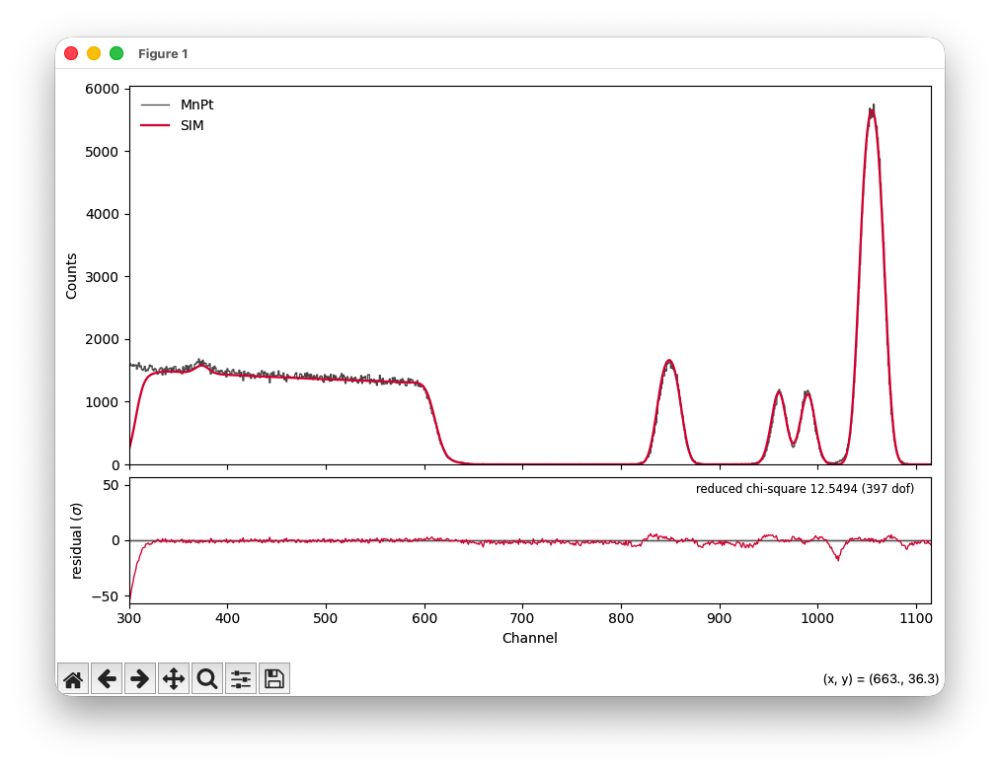

# Getting started

## Install

```bash
pip install pyrump
```

## Quick start

```bash
pyrump                         # the interactive shell, from any directory
```

### Data loading

Anything ending in `.rbs`/`.RBS` might be one of two unrelated things: RUMP's
own binary spectrum format, or a plain-text acquisition macro that just
happens to share the extension. `GET` and `XEQ` load them, respectively —
using the wrong one gets you a clear error rather than garbage data. See
[File formats](../manual/shell.md#file-formats) in the manual for the full
specification of both.

**Example 1 — RUMP binary format (.rbs)**

`examples/2A.rbs` is a real binary spectrum (Cornell format, mode-2
differential-compressed counts):

```
Your wish? cd examples
Your wish? get 2A.rbs
active buffer is now 1
```

`GET` decodes the file's records directly — calibration, geometry,
accelerator settings and the 2048 channel counts all arrive in one call. The
spectrum lands in **buffer 1**: in RUMP, buffer 1 is always "whatever was
read most recently," not a fixed slot, and every other data buffer shifts up
one to make room (buffer 0 is reserved for the simulation and is never
touched by `GET`). Buffer 1 also becomes the **active** buffer, so `PLOT`,
`COMPARE`, `INTEGRAL` and friends act on it right away:

```
Your wish? active
Buffer 1:
  File       2A.rbs
  Identifier Binghampton_target_02A.RBS  RBS LT =  905.98 RT  962.42
  ...
Your wish? plot 1
```

**Example 2 — an acquisition macro under a `.RBS` extension**

Some acquisition software (NEC's RC43 among them) writes its output as a
plain-text `EMPTY`/`SWALLOW` command macro named `something.RBS`, despite the
name suggesting real spectrum data. `examples/MnPt.RBS` is one of these —
load it with `XEQ`, not `GET`:

```
Your wish? xeq MnPt.rbs
buffer 1 emptied
  c:\RBS\data\2022\01\MnPt.RBS
  MnPt.RBS  170 Degree RBS LT =  2457.874 RT  2463.078 Gain  2
  ...
2048 points entered into buffer 1
```

`XEQ` replays the file line by line through the same command interpreter as
the prompt: it sets `IDENTIFIER`, `DATE`, `CONVERSION`, the beam and geometry,
then hits `SWALLOW`, which reads every following line as channel data
straight into the buffer — landing in buffer 1 exactly like `GET` does.

Loading either file with the wrong command fails loudly instead of silently
misreading it:

```
Your wish? get MnPt.rbs
could not read .../MnPt.RBS: .../MnPt.RBS is a text command macro
(RC43's EMPTY/SWALLOW convention), not a binary RUMP spectrum -- use XEQ,
not GET, to load it

Your wish? xeq 2A.rbs
.../2A.rbs is not a text command file (...) -- binary spectrum data belongs
with GET, not XEQ
```

### Plotting

Picking up with buffer 1 already loaded (either example above works), `PLOT`
opens one persistent matplotlib window whose state survives between
commands:

```
Your wish? plot 1               /* erase and plot buffer 1             */
Your wish? region 100 400       /* zoom to a channel range             */
Your wish? sqrt                 /* sqrt yield scale, redraws right away */
```

See [Plotting](../manual/shell.md#plotting) in the manual for the rest —
`OVERLAY`, `COMPARE`, `EXPAND`, `LOG`/`LINEAR`/`SQRT`, `ENERGY`, `FIGSAVE` and
more.

### Simulating with SIM

`SIM` edits the sample description that `COMPARE` and `PERT` fit against.
`examples/MnPt.lcm` is a real 5-layer description for the spectrum loaded
above — `SIM GET`/`SIM SHOW` work as one-shots, with no need to enter the
`SIM` sub-level for a quick look:

```
Your wish? sim get MnPt.lcm
read MnPt.lcm: 5 layers
Your wish? sim show
 >  1            40 A        Ru 1
    2           331 A        Mn 2.73 Pt 1
    3            40 A        Ru 1
    4           330 A        Si 1 O 2
    5          1000 nm       Si 1
  maxpth 1000   straggle 0   multiple 0   absorber 0
Your wish? compare              /* data vs. simulation, with residuals */
```

Buffer 0 is always the simulation and recomputes itself whenever the sample
or the active buffer's parameters change — there is no "simulate" command,
exactly as in the original.

See [SIM and PERT](../manual/sim-pert.md) in the manual for the full `SIM`
command set — editing layers interactively, depth-profile equations,
straggling and more.

### Fitting with PERT

`PERT` picks which sample and instrument parameters may vary and over which
channel window, then fits them by least squares. `examples/MnPt.pert` is a
saved selection for the sample above; `GET ... GO` replays it and runs the
fit in one line:

```
Your wish? pert get MnPt.pert go
  ...
  Fitting MnPt: Si [1000nm] - SiO2 [330A] - Ru [40A] - Mn2.73Pt [331A] - Ru [40A]

  fit took 0.18 s

  reduced chi-square 12.3538 on 397 dof
  35 evaluations, `xtol` termination condition is satisfied.
  kev(0)                            48.4324  +/- 0.04736   (was 48)
  layer 2 thickness                     250  +/- 0.5042   (was 254)
  layer 2 composition Mn             2.8231  +/- 0.01217   (was 2.73495)
  fwhm                              24.9921  +/- 0.03427   (was 15)

  MnPt: Si [1000nm] - SiO2 [330A] - Ru [40A] - Mn2.82Pt [326A] - Ru [40A]
```

Fitted values are written back into the sample description (`SIM SHOW`
reflects them), and `COMPARE` shows how the result actually matches the data:

```
Your wish? region 300 1130      /* zoom to the fitted window            */
Your wish? compare              /* data vs. simulation, with residuals  */
Your wish? figsave fit.png
```



See [SIM and PERT](../manual/sim-pert.md) in the manual for the full `PERT`
command set — bounded fits, `WINDOW`/`NORMALIZE`, `REPORT`, and the
composition-degeneracy caveat worth reading before your first real fit.

### Command line

Or drive it as one-off batch commands, without the interactive shell:

```bash
pyrump simulate sample.lcm --energy 2.0 --beam 4He -o out.rbs
pyrump fit sample.lcm measured.rbs --vary thickness:0 --window 190 226
pyrump plot measured.rbs --compare out.rbs -o comparison.png
pyrump convert measured.rbs measured.dat
```

See [CLI reference](../manual/cli.md) for every option, or [Python API](../dev/python-api.md)
to call the library directly.
