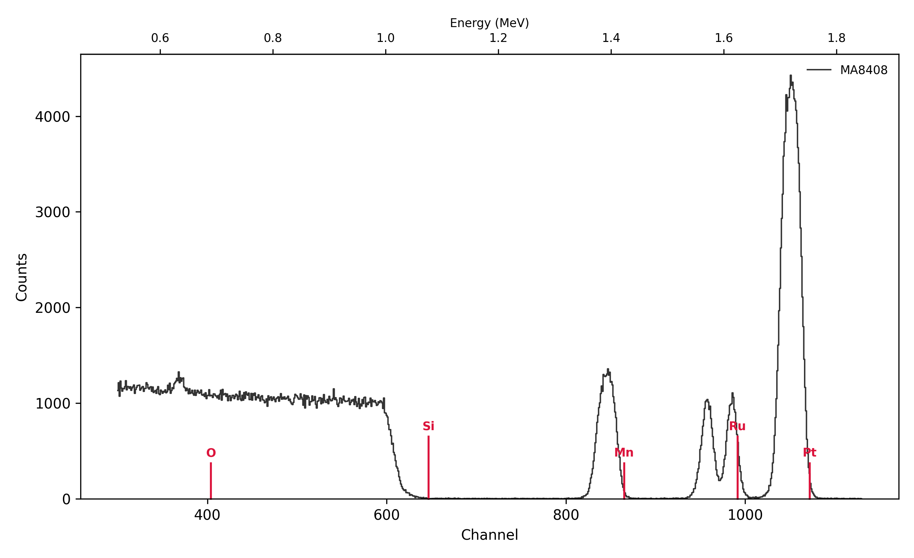
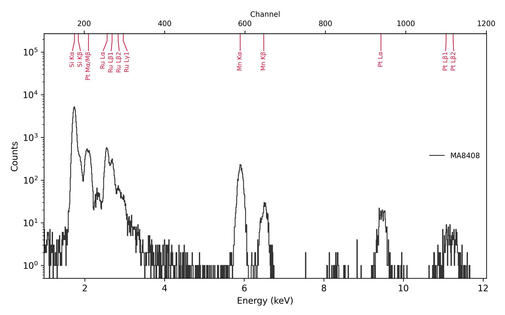

# Worked example: an MnPt film, fitted with RBS and checked with PIXE

This walk-through fits a real measurement with RBS alone, then holds the
result against the PIXE spectrum measured in the same run. Unlike Fe and
Ni, Mn and Pt are far apart in RBS, so RBS gives the composition by
itself. PIXE is not fitted at all: it only checks that every element is
where the RBS sample puts it, in about the right amount. It uses the two
files in `examples/`:

* `MnPt.RBS`, the RBS spectrum: an RC43 acquisition macro, 1.9 MeV ⁴He⁺,
  10 µC, detector at 170°, sample tilted to `THETA -9`;
* `MnPt.PIX`, the PIXE spectrum measured in the same run, with the same
  charge.

The sample is Si / SiO₂ / Ru / MnPt / Ru: an MnPt film between two thin
Ru layers, on the oxide of a Si wafer. The question is the MnPt
composition and the layer thicknesses.

Every command below is typed at the prompt it is shown with. The outputs
are pyRUMP's own, from this data.

## 1. Load both spectra

`PAIR ON` makes reading `x.RBS` also read `x.PIX` from the same folder
into the same buffer, so the two spectra share the beam, the tilt and the
charge:

```
Your wish? cd examples
Your wish? pixe pair on
  pair on
  ! THETA 0 from the RBS buffer (PAIR ON): beam 0 deg, X-rays 45 deg to the sample normal
Your wish? xeq MnPt.RBS
buffer 1 emptied
  c:\RBS\data\2026\08\MA8408.RBS
  MA8408.RBS  170 Degree RBS LT =  951.165 RT  953.288 Gain  2
  16:43:33  08-19-2026
  1.59 keV/channel, offset 48 keV
  MeV = 1.901
  beam Z=2 mass=4.0026 charge state 1
  geometry = general
  theta = -9 deg
  phi = 11 deg
  psi = 20 deg
  omega = 2.7 msr
  first = 0
  FWHM = 15 keV
  current = 10.94 nA
  charge = 10 uC
2048 points entered into buffer 1
  PAIR: MnPt.PIX -> PIXE of this buffer
```

The sample's name, `MA8408`, is the first word of the spectrum's
identifier. `SNAP` names its files after it (step 6).

## 2. Read the RBS and PIXE spectra

`PIXE` turns PIXE on, so `PLOT` shows the PIXE spectrum in its own window
next to the RBS one. Zoom both on what matters, and ask `ELEMENT` where
each element should show up:

```
Your wish? pixe
PIXE enabled: PLOT and COMPARE now show PIXE too (DISABLE turns it off)
PIXE Command: region 100 1200
  region 100 to 1200
PIXE Command: return
Your wish? plot 1
Your wish? region 300 1130
Your wish? element Pt Ru Mn Si O
  Pt  Z=78  Mass=195.090  K(ion)=0.9219  Energy=  1752.5 keV  Channel=1072.026
      X-rays  Lα 9.435 keV ch 938.2   Lβ1 11.071 keV ch 1100.3   Lβ2 11.248 keV ch 1117.9
              Lγ1 12.942 keV ch 1285.6   Mα 2.050 keV ch 206.8   Mβ 2.127 keV ch 214.5
  Ru  Z=44  Mass=101.070  K(ion)=0.8547  Energy=  1624.7 keV  Channel= 991.656
      X-rays  Kα 19.235 keV ch 1908.8   Lα 2.558 keV ch 257.2   Lβ1 2.683 keV ch 269.6
              Lβ2 2.836 keV ch 284.7   Lγ1 2.965 keV ch 297.5
  Mn  Z=25  Mass= 54.938  K(ion)=0.7488  Energy=  1423.5 keV  Channel= 865.090
      X-rays  Kα 5.895 keV ch 587.7   Kβ 6.490 keV ch 646.6   Lα 0.637 keV ch 66.9
              Lβ1 0.648 keV ch 68.0
  Si  Z=14  Mass= 28.086  K(ion)=0.5663  Energy=  1076.4 keV  Channel= 646.819
      X-rays  Kα 1.740 keV ch 176.1   Kβ 1.836 keV ch 185.7
  O   Z= 8  Mass= 15.999  K(ion)=0.3631  Energy=   690.2 keV  Channel= 403.874
      X-rays  Kα 0.525 keV ch 55.8
```

For each element `ELEMENT` gives the RBS surface edge and, with PIXE on,
the main X-ray lines, and marks both on the plots.



The **RBS spectrum**, from high to low energy:

* a **Pt** peak near channel 1055, a little below the Pt surface edge:
  the MnPt film lies under the top Ru layer;
* **two Ru peaks**, near 985 and 958. The higher one, at the Ru surface
  edge, is the Ru layer on top; the lower one is the Ru layer under the
  MnPt, its ions having lost energy crossing the film on the way in and
  out;
* an **Mn** peak near 845, below the Mn surface edge for the same reason
  as the Pt;
* the **Si** step near 600 and the **O** peak near 365, both well below
  their surface edges: the oxide and the wafer lie under the metal.

Mn and Pt are some 200 channels apart, so RBS separates them easily: their
peak areas give the composition, and their widths the film thickness.
That is the difference from the [FeNi example](feni-rbs-pixe.md), where
Fe and Ni overlap and the composition has to come from PIXE.



The **PIXE spectrum** has a line for every element of the sample except
O, whose K line at 0.5 keV the detector's window and filter stop: Si K
from the wafer and the oxide, Pt M and Ru L just above it, Mn Kα and Kβ,
and Pt Lα and Lβ. There is no line that the sample doesn't explain, so
no element is missing from it.

Unlike the FeNi data, this spectrum needs no PIXE setup: pyRUMP's
[built-in PIXE defaults](../manual/pixe.md#detector-setup) are this
detector's, measured on this very spectrum, so the markers sit on the
peaks as they are.

## 3. Describe the sample in SIM, layer by layer

Layer 1 is the surface, the layer the beam meets first. Each layer gets a
thickness and a composition; the composition list ends with `/`. The
unit follows the number: `A` (Å, the default), `nm`, `um`, or a compound
from `density.tab`.

```
Your wish? sim
SIM Command: layer 1
  you are now working on a fresh layer # 1 (of 0)
SIM Command: thickness 40 A
SIM Command: composition Ru 1 /
SIM Command: next
  you are now working on a fresh layer # 2 (of 1)
SIM Command: thickness 300 A
SIM Command: composition Mn 3 Pt 1 /
SIM Command: next
  you are now working on a fresh layer # 3 (of 2)
SIM Command: thickness 40 A
SIM Command: composition Ru 1 /
SIM Command: next
  you are now working on a fresh layer # 4 (of 3)
SIM Command: thickness 300 SIO2
SIM Command: composition Si 1 O 2 /
SIM Command: next
  you are now working on a fresh layer # 5 (of 4)
SIM Command: thickness 5 um
SIM Command: composition Si 1 /
SIM Command: show
    1            40 A        Ru 1        [29 /CM2  Ru 29.03]
    2           300 A        Mn 3 Pt 1   [231 /CM2  Mn 173.35 Pt 57.78]
    3            40 A        Ru 1        [29 /CM2  Ru 29.03]
    4           300 SIO2     Si 1 O 2    [198 /CM2  Si 66 O 132]
 >  5             5 um       Si 1        [24888 /CM2  Si 24888.43]
  maxpth 1000   straggle 0   multiple 0   absorber 0
SIM Command: save MnPt
wrote MnPt.lcm
SIM Command: return
```

* **Layers 1–3, Ru / MnPt / Ru**: rough starting values for the fit.
  `Mn 3 Pt 1` is a starting ratio; in MODE COMP the numbers are relative
  amounts.
* **Layer 4, SiO₂, 300 Å**, also fitted. The unit is `SIO2`, not `A`: Å
  are converted to atoms/cm² with an atomic density, and for a compound
  `A` takes it from the pure elements (300 Å of SiO₂ would be only
  135 × 10¹⁵ at/cm² instead of 198). `SIO2` is Å at silica's own density,
  from `density.tab`. For Ru and MnPt the elements' densities are right.
* **Layer 5, the Si wafer**: the last layer is the substrate. It only has
  to be thicker than the beam can see; 5 µm is plenty for 1.9 MeV He, and
  it also gives PIXE the full Si K yield of the wafer.

`SIM SAVE MnPt` writes the description to `MnPt.lcm` — the file of that
name in `examples/` is exactly this — and `SIM GET MnPt` reads it back.

## 4. Fit RBS in PERT

```
Your wish? pert
PERT Command: window 400 1200
  error windows [1] 400-1200
PERT Command: fwhm
  varying fwhm
PERT Command: correction
  varying correction
PERT Command: kev(0)
  varying kev(0)
PERT Command: thickness 1
  varying layer 1 thickness
PERT Command: thickness 2
  varying layer 2 thickness
PERT Command: thickness 3
  varying layer 3 thickness
PERT Command: composition 2 Mn
  varying layer 2 composition Mn
PERT Command: kev/ch
  varying kev/ch
PERT Command: thickness 4
  varying layer 4 thickness
PERT Command: parms
  mode        multiple variable
  autocmp     off
  autosnap    off
  highlight   on
  error win   [1] 400-1200
  norm win    (none)
  PIXE win    (none -- RBS only)
  varying:
    [1] fwhm
    [2] correction
    [3] kev(0)
    [4] layer 1 thickness
    [5] layer 2 thickness
    [6] layer 3 thickness
    [7] layer 2 composition Mn
    [8] kev/ch
    [9] layer 4 thickness
```

What each setting does:

* **`WINDOW 400 1200`**: the RBS channels fitted: the Si step, and the Mn,
  Ru and Pt peaks. The O peak, below channel 400, is left out; the SiO₂
  shows in the window through where the Si step sits.
* **`FWHM`, `KEV(0)`, `KEV/CH`**: the RBS resolution and energy
  calibration. The values in the file header are only a starting point.
* **`CORRECTION`**: the dose. The height of the Si plateau depends only on
  the dose and on silicon's stopping, so the window's Si plateau pins it.
  `CORRECTION` applies to the PIXE spectrum too, which step 5 relies on.
* **`THICKNESS 1`, `2`, `3`, `4`**: the top Ru, the MnPt, the bottom Ru
  and the SiO₂. The substrate stays as it is.
* **`COMPOSITION 2 Mn`**: Mn's content against Pt, which stays at 1 as the
  reference.

`PARMS` shows `PIXE win (none -- RBS only)`: with no `PIXWIN`, nothing is
fitted to PIXE. `GO` fits:

```
PERT Command: go
  Fitting MA8408: Si [5um] - SiO2 [300SIO2] - Ru [40A] - Mn3Pt [300A] - Ru [40A]

  fit took 0.43 s

  reduced chi-square 4.2900 on 792 dof   (was 141.5915)
  66 evaluations, converged
  fwhm                              19.2299  +/- 0.1166   (was 15)
  correction                       0.855636  +/- 0.001678   (was 1)
  kev(0)                            47.3853  +/- 0.1454   (was 48)
  layer 1 thickness                    40 A  +/- 0.3326 A   (was 40 A)   [29 /CM2]
  layer 2 thickness                   314 A  +/- 0.7404 A   (was 300 A)   [242 /CM2]
  layer 3 thickness                    41 A  +/- 0.3266 A   (was 40 A)   [30 /CM2]
  layer 2 composition Mn            2.74154  +/- 0.01577   (was 3)
  kev/ch                            1.59761  +/- 0.0001069   (was 1.59)
  layer 4 thickness                325 SIO2  +/- 6.634 SIO2   (was 300 SIO2)   [215 /CM2]

  MA8408: Si [5um] - SiO2 [325SIO2] - Ru [41A] - Mn2.74Pt [314A] - Ru [40A]
PERT Command: go
  ...
  reduced chi-square 3.9872 on 792 dof   (was 4.2731)
  ...
PERT Command: go
  ...
  reduced chi-square 3.7188 on 792 dof   (was 3.9872)
  ...
PERT Command: go
  Fitting MA8408: Si [5um] - SiO2 [325SIO2] - Ru [41A] - Mn2.75Pt [314A] - Ru [39A]

  fit took 0.27 s

  reduced chi-square 3.7029 on 792 dof   (was 3.7190)
  39 evaluations, converged
  fwhm                              20.3534  +/- 0.1265   (was 20.21)
  correction                       0.857688  +/- 0.001695   (was 0.857432)
  kev(0)                            45.4401  +/- 0.1634   (was 45.8488)
  layer 1 thickness                    39 A  +/- 0.3419 A   (was 39 A)   [29 /CM2]
  layer 2 thickness                   314 A  +/- 0.8059 A   (was 314 A)   [241 /CM2]
  layer 3 thickness                    41 A  +/- 0.3295 A   (was 41 A)   [30 /CM2]
  layer 2 composition Mn            2.74087  +/- 0.01609   (was 2.75193)
  kev/ch                            1.59945  +/- 0.000121   (was 1.59917)
  layer 4 thickness                325 SIO2  +/- 7 SIO2   (was 325 SIO2)   [215 /CM2]

  MA8408: Si [5um] - SiO2 [325SIO2] - Ru [41A] - Mn2.74Pt [314A] - Ru [39A]
```

Run `GO` until nothing moves, here four times. The composition and the
thicknesses are settled after the first; the resolution and the
calibration offset, which trade off against each other on the peak edges,
take a few rounds more. A fifth `GO` changes nothing.

```
PERT Command: highlight off
  highlight off
PERT Command: return
Your wish? compare
Your wish? element Pt Ru Mn Si O
```

`HIGHLIGHT OFF` leaves the fit window unshaded, for a cleaner figure.


The fit follows the whole window, and below it the O peak too, which it
was not fitted to. What remains is on the peak flanks: the data are
above the simulation in the valley between the Ru and Pt peaks (around
channel 1020) and on the low-energy side of the Mn peak (around 820). Some intermixing or
roughness at the interfaces, which the model's sharp interfaces leave
out, would do that.

```
Your wish? sim show
 >  1            39 A        Ru 1           [29 /CM2  Ru 28.54]
    2           314 A        Mn 2.74 Pt 1   [241 /CM2  Mn 176.83 Pt 64.52]
    3            41 A        Ru 1           [30 /CM2  Ru 29.71]
    4           325 SIO2     Si 1 O 2       [215 /CM2  Si 71.56 O 143.13]
    5             5 um       Si 1           [24888 /CM2  Si 24888.43]
  maxpth 1000   straggle 0   multiple 0   absorber 0
```

| Layer | Thickness | Areal density (10¹⁵ at/cm²) | Composition |
|---|---|---|---|
| Ru | 39 Å | 29 | |
| MnPt | 314 Å | 241 (Mn 177, Pt 65) | Mn/Pt = 2.74 ± 0.02, i.e. Mn₇₃Pt₂₇ |
| Ru | 41 Å | 30 | |
| SiO₂ | 325 Å | 215 | |

The uncertainties are statistical only, as PERT reports them; the
thicknesses in Å assume the elements' densities (silica's for the SiO₂).
The fitted `CORRECTION`, 0.858, means about 17 % more ions reached the
sample than the 10 µC the integrator recorded.

## 5. Check the result against PIXE

PIXE was turned on in step 2, so the `COMPARE` above also put the PIXE
spectrum against the PIXE simulation of the fitted sample, at the dose
the fit found. Nothing in it was fitted to PIXE:


Every line is where the sample puts it, and on the log scale every line
is about the right size. The residuals between the lines are the
continuum background, and the peak tails, which pyRUMP doesn't model yet
(the [PIXE manual](../manual/pixe.md) lists what is and isn't
simulated): the data are above the simulation there.

For the sizes, `LINES` at the PIXE prompt lists the simulated counts of
each line, largest first, with totals per shell:

```
Your wish? pixe
PIXE Command: lines
  element  line    E (keV)   sigma (b)   efficiency      counts
  Si       KL3      1.7400       307.1       0.0033   3.166e+04
  Si       KL2      1.7394       154.5       0.0033   1.584e+04
  Ru       L3M5     2.5585       140.7       0.1551        5359
  Pt       M5N7     2.0500       532.5       0.0286        4194
  Pt       M4N6     2.1270       250.8       0.0410        2834
  Ru       L2M4     2.6833        54.8       0.1978        2657
  Mn       KL3      5.8987       3.959       0.8582        2596
  ...
  totals:  Si K 5.057e+04, Ru L 9810, Pt M 9099, Mn K 4465, Pt L 577, Ru K 3.187, Pt K 0.0004016, Mn L 1.554e-22, O K 5.882e-28
PIXE Command: exportcmp mnpt-pixe.csv
wrote mnpt-pixe_pixe.csv: 2048 PIXE channels, reduced chi-square 16.2318 (1101 dof)
```

`EXPORTCMP` writes the measured and simulated counts channel by channel.
Summed over each group of lines:

| Lines | Energy (keV) | Measured | Simulated | Simulated / measured |
|---|---|---|---|---|
| Si K | 1.55–1.95 | 49 263 | 50 613 | 1.03 |
| Pt M | 1.95–2.22 | 8 106 | 7 331 | 0.90 |
| Ru L | 2.45–3.10 | 9 977 | 10 694 | 1.07 |
| Mn Kα | 5.65–6.15 | 2 848 | 3 904 | 1.37 |
| Mn Kβ | 6.30–6.70 | 412 | 545 | 1.32 |
| Pt Lα | 9.20–9.70 | 347 | 361 | 1.04 |
| Pt Lβ | 10.80–11.50 | 181 | 165 | 0.91 |

* **Pt and Ru agree.** The Pt L lines, the Pt M lines and the Ru L lines
  come out within 10 % of the measurement. That checks the Pt and Ru
  amounts RBS found, and the dose: the PIXE simulation runs at the
  `CORRECTION` the RBS fit set.
**Mn K is about 35 % too strong.** RBS gives Mn as reliably as Pt here,
so the excess is on the PIXE side: the setup's constants for K lines.
The [FeNi example](feni-rbs-pixe.md), on the same detector, found
H_K = 0.78 — K lines 1.3 times too strong — which is the same thing.
With that H_K, Mn K agrees to within 7 %:

```
PIXE Command: h k 0.78
  h 0.78 1 1  ! K, L, M
```

| Lines | Simulated / measured, H_K = 1 | H_K = 0.78 |
|---|---|---|
| Mn Kα | 1.37 | 1.07 |
| Mn Kβ | 1.32 | 1.03 |
| Si K | 1.03 | 0.80 |

Si K then drops 20 % low. The built-in filter thickness was measured on
this spectrum's Si K with H_K = 1, so it already absorbs part of the same
error. One H_K can't put both Si K and Mn K right until the filter and H
are calibrated together on a standard.

So PIXE confirms the sample: every line is accounted for, Pt and Ru
agree, and Mn agrees once the detector's K-line constant is set from
another measurement. To get amounts from PIXE alone, calibrate H on a
standard first (see [Yield](../manual/pixe.md#yield)). Set H back before
going on:

```
PIXE Command: h k 1
  h 1 1 1  ! K, L, M
PIXE Command: return
```

## 6. Keep the result: SNAP

`SNAP` (`SNAPSHOT`) writes the sample, the fit setup, both plots and a
restore macro, named after the sample:

```
Your wish? snap

  updated MA8408.report
  wrote MA8408.pert
  wrote MA8408.lcm
  wrote MA8408_rbs.png
  wrote MA8408_pixe.png
  wrote MA8408_fit.xeq
```

`MA8408.report` gets the last fit and the sample, appended after any
earlier ones; `MA8408.lcm` is the fitted sample. `MA8408.pert` holds
everything step 4 typed — it is `examples/MnPt.pert` — and replays it in
one line:

```
window 400 1200
fwhm
correction
kev(0)
thickness 1
thickness 2
thickness 3
composition 2 Mn
kev/ch
thickness 4
```

```
Your wish? sim get MnPt
Your wish? pert get MnPt go
```

`PERT GET ... GO` is one `GO`; type `GO` again until nothing moves, as in
step 4. `AUTOSNAP` in PERT saves after every `GO` by itself, and
`pyrump MA8408_fit.xeq` restores the whole session later; the
[FeNi example](feni-rbs-pixe.md#5-keep-the-result-autosnap-and-snap)
shows both.

See [SIM](../manual/sim.md), [PERT](../manual/pert.md),
[PIXE](../manual/pixe.md) and
[`SNAPSHOT`](../manual/shell.md#snapshot-snap-new) in the manual for every
option used here.
