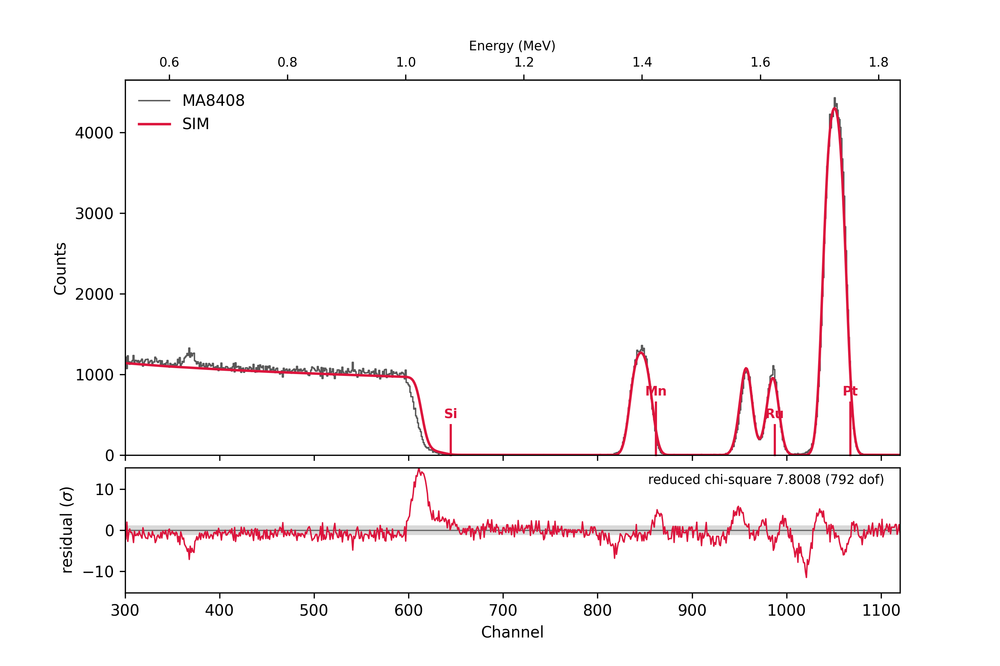
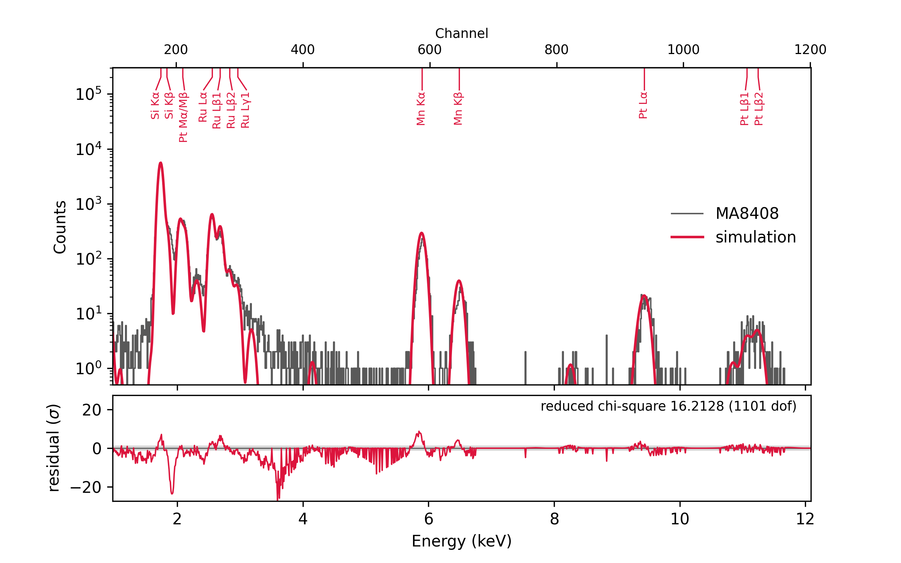

# pyRUMP

  

    
    
    
  

  

    <pre class="ascii-banner">
########  ##    ## ########  ##     ## ##     ## ########  
##     ##  ##  ##  ##     ## ##     ## ###   ### ##     ## 
##     ##   ####   ##     ## ##     ## #### #### ##     ## 
########     ##    ########  ##     ## ## ### ## ########  
##           ##    ##   ##   ##     ## ##     ## ##        
##           ##    ##    ##  ##     ## ##     ## ##        
##           ##    ##     ##  #######  ##     ## ##        
    </pre>
    
$ pyrump

  

An AI-powered Python reimplementation of **RUMP**, the Rutherford backscattering
spectrometry (RBS) simulation and analysis package originally written by
L. R. Doolittle and M. O. Thompson at Cornell. pyRUMP installs via a standard
`pip install` and runs on Windows, macOS, and Linux.

The original RUMP is ~22k lines of C code from the late 1980s (archived for historical
reference at [github.com/ikost/Rump-and-Genplot-Archive](https://github.com/ikost/Rump-and-Genplot-Archive)), with an
HTML manual and no active support; the distribution was previously available via
`genplot.com`, now abandoned and no longer resolving.
pyRUMP reproduces the simulation physics and data-analysis flow as a tested, importable
Python library, with both a classical RUMP CLI and a Python API. Plotting uses matplotlib;
fitting uses scipy/numpy.

Each of these was a deliberate choice. The original C code needed a separate makefile per
platform (`makeaix`, `makelnx`, `makeosx`, `makesgi`, `makesolaris`, ...); Python collapses
that into one `pip install` that runs unmodified on Windows, macOS, and Linux. scipy and
numpy provide compiled, vectorized numerical routines, so the least-squares fitting and
data analysis stay fast without any hand-written C. And matplotlib's backend system
replaces the dozen-plus hardware-specific printer and plotter drivers GENPLOT used to ship
(`deskjet`, `epson`, `hpgl`, `laserjet`, `postdrv`, `tektrx`, `xdriver`, and more) with a
single plotting API that targets any output device.

Rewriting RUMP from scratch with AI assistance is also a chance to move past a straight
port. A handful of bugs in the original C are already fixed rather than just reproduced
(kept honest by validating both against the C oracle — see [RUMP quirks and
defects](dev/rump-quirks.md)). New physics has been added, like Andersen screening
alongside RUMP's original L'Ecuyer correction (see the [`SCREENING`](manual/config.md#screening-new)
command). And the user workflow is gaining new commands beyond what RUMP ever had, like
automatic per-fit snapshots with [`AUTOSNAP`](manual/pert.md#autosnap-new), and
[`SNAPSHOT`](manual/shell.md#snapshot-snap-new), which saves a session — fitted or tuned
by hand — as a macro that brings it back. SIMNRA's
`.xnra` files can be read and written, spectrum, instrument settings and sample together,
with [`GETNRA`/`WRITENRA`](manual/buffers.md#getnra-writenra-new); NDF support is planned.

**New in pyRUMP 2.0: PIXE.** The beam that gives the RBS spectrum also
makes X-rays, and pyRUMP now simulates them: the K, L and M lines of every
element in the SIM sample, with ECPSSR ionisation cross sections, absorption
in the sample and the detector's filters, and the detector's resolution and
escape peaks, in a [PIXE](manual/pixe.md) window beside the RBS one. PERT
fits both spectra from the same sample, each element to the spectrum that
sees it best, so alloys that overlap in RBS, such as Fe–Ni or W–Ta, take
their composition from their X-ray lines and their thickness from RBS. The
[FeNi worked example](getting-started/feni-rbs-pixe.md) goes through one
measurement from start to finish.

The original RUMP ecosystem included **RUMPX**, an X-Window GUI popular among Windows
users two decades ago. pyRUMP doesn't have a GUI counterpart yet — the author prefers
CLI tools — but a Python equivalent could be added later if there's real demand for it.

*Measured RBS data (grey) vs. a pyRUMP fit (red) of a Si / Ru / Mn2.73Pt1 / Ru stack, with the elements' surface edges marked.*

*The PIXE spectrum taken with the same beam (grey) vs. pyRUMP's PIXE simulation (red) of the sample fitted to the RBS above, with the X-ray lines marked.*

## Where to go next

- **[Getting started](getting-started/index.md)** — install pyRUMP and run your first simulation
- **[Manual](manual/physics.md)** — what the forward model computes, the interactive shell, CLI, and sample-description reference
- **[Development](dev/python-api.md)** — the Python API, contributing, validation against the original, and porting notes
