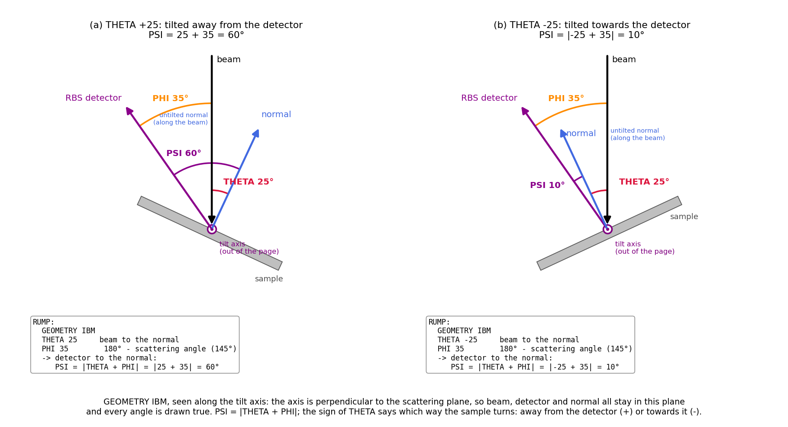

## Experimental geometry

An RBS spectrum depends on three directions: the **beam**, the **detector**
and the **sample normal**. Three angles between them describe the
experiment, each set on the data buffer:

| Command | Angle between | What it sets |
|---|---|---|
| [`THETA`](buffers.md#theta) | the beam (looking back at the source) and the sample normal | the beam's path into the sample |
| [`PHI`](buffers.md#phi) | the beam (looking back at the source) and the detector: **180° minus the scattering angle** | the kinematics and the cross section |
| [`PSI`](buffers.md#psi) | the detector and the sample normal | the particles' path out of the sample |

A detector at a scattering angle of 170° is `PHI 10`, not `PHI 170` — RUMP's
convention, kept by pyRUMP (see [Things that will catch you
out](gotchas.md)).

The three angles are not independent: they are the angles between three
directions, so `PSI` can only lie between |THETA − PHI| and THETA + PHI.
[`GEOMETRY`](buffers.md#geometry) says how pyRUMP gets `PSI`:

* **`IBM`** — the sample normal stays in the plane of the beam and the
  detector; `PSI` is computed from `THETA` and `PHI` (below).
* **`CORNELL`** — the sample's tilt axis lies in that plane, across the beam,
  so tilting moves the normal out of it; `PSI` is computed as
  cos PSI = cos THETA × cos PHI, whatever the sign of `THETA`.
* **`GENERAL`** — `PSI` is used as typed. Acquisition files often use it:
  `examples/MnPt.RBS` has `GEOMETRY GENERAL`, `THETA -9`, `PHI 11`, `PSI 20`.

With `IBM` or `CORNELL`, a typed `PSI` is ignored.

### IBM geometry

The tilt axis is perpendicular to the scattering plane — the plane of the
beam and the detector — so the sample normal turns within it, and the beam,
the detector and the normal stay in one plane. Seen along the tilt axis,
every angle is drawn true:

PSI = |THETA + PHI|. The sign of `THETA` says which way the sample turns:
positive away from the detector, negative towards it. RUMP's own manual:
"The sign ambiguity is resolved so that PSI = THETA+PHI. If the sample normal
points to the detector, then THETA should equal −PHI."

`examples/MnPt.RBS` has `GEOMETRY GENERAL`, `THETA -9`, `PHI 11`, `PSI 20`.
Its PSI 20 = 9 + 11 is the IBM value for a sample turned 9° away from the
detector, which RUMP's IBM convention would write as `THETA 9`. The
acquisition software writes `THETA -9` and spells `PSI` out, so the file
needs `GENERAL`.

When fitting, [`PERT THETA`](pert.md#theta) varies `THETA`; with `IBM` or
`CORNELL` the exit angle follows it, with `GENERAL` it stays at `PSI`.
